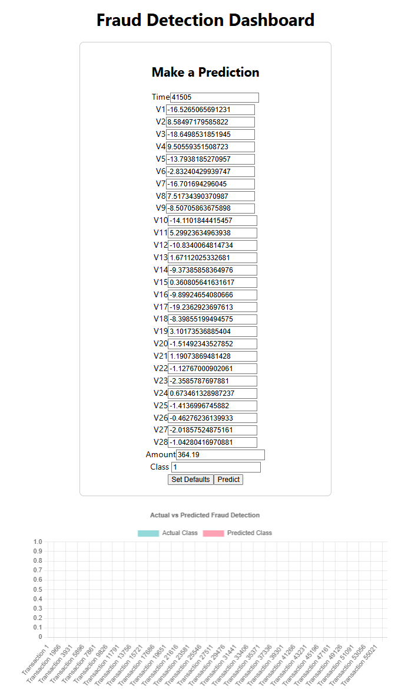

# Fraud Detection Dashboard

## Overview
This project is a **Fraud Detection Dashboard** that uses machine learning (XGBoost) to detect fraudulent transactions in a credit card dataset. The backend is built using **FastAPI**, and the frontend is a **React** app that visualizes the results.

### Key Features
1. **Default Predictions**:
   - When the app loads, it displays the **actual vs predicted** classes for the entire test dataset (`test.csv`).

2. **Set Defaults**:
   - Users can click the **Set Defaults** button to populate the input form with the first row of the test dataset.

3. **Make Predictions**:
   - Users can modify the input values and click **Predict** to see the result on the chart.

4. **Interactive Dashboard**:
   - The dashboard includes a chart to visualize the actual and predicted fraud classes.

---

## Project Structure
```
fraud-detection-project/
├── backend/
│   ├── app/
│   │   ├── __init__.py
│   │   ├── main.py              # FastAPI application
│   │   └── model.py             # Pydantic models
│   ├── scripts/
│   │   └── train_model.py       # Script to train the model
│   ├── creditcard.csv           # Dataset
│   ├── fraud_detection_model.pkl # Trained XGBoost model
│   ├── test.csv                 # Test dataset
│   ├── requirements.txt         # Python dependencies
│   └── Dockerfile               # Dockerfile for FastAPI backend
├── frontend/
│   ├── fraud-detection-dashboard/
│   │   ├── public/
│   │   ├── src/
│   │   │   ├── components/
│   │   │   │   ├── InputForm.js # Form for user input
│   │   │   │   └── Chart.js     # Chart to visualize results
│   │   │   ├── App.js           # Main React component
│   │   │   ├── index.js         # Entry point for React app
│   │   │   └── App.css          # Styles for the app
│   │   ├── package.json         # React app dependencies
│   │   ├── Dockerfile           # Dockerfile for React app
│   │   └── README.md            # Frontend documentation
├── docker-compose.yml           # Docker Compose for multi-container setup
└── README.md                    # Project documentation
```

---

## Setup Instructions

### Prerequisites
1. **Python 3.9+**
2. **Node.js 16+**
3. **Docker** (optional)

## Usage
1. Open your browser and go to `http://localhost:3000`.

2. **Default Predictions**:
   - When the app loads, the chart displays the **actual vs predicted** classes for the entire test dataset.

3. **Set Defaults**:
   - Click the **Set Defaults** button to populate the input form with the first row of the test dataset.

4. **Make Predictions**:
   - Modify the input values and click **Predict** to see the result on the chart.

---

## Example Screenshot


---

## Technologies Used
- **Backend**:
  - FastAPI
  - XGBoost
  - Scikit-learn
  - Pandas
  - Joblib

- **Frontend**:
  - React
  - Axios
  - Chart.js
  - React-Chartjs-2

- **Deployment**:
  - Docker
  - Docker Compose

---

## License
This project is licensed under the MIT License. See the [LICENSE](LICENSE) file for details.
